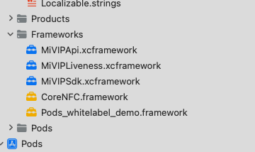
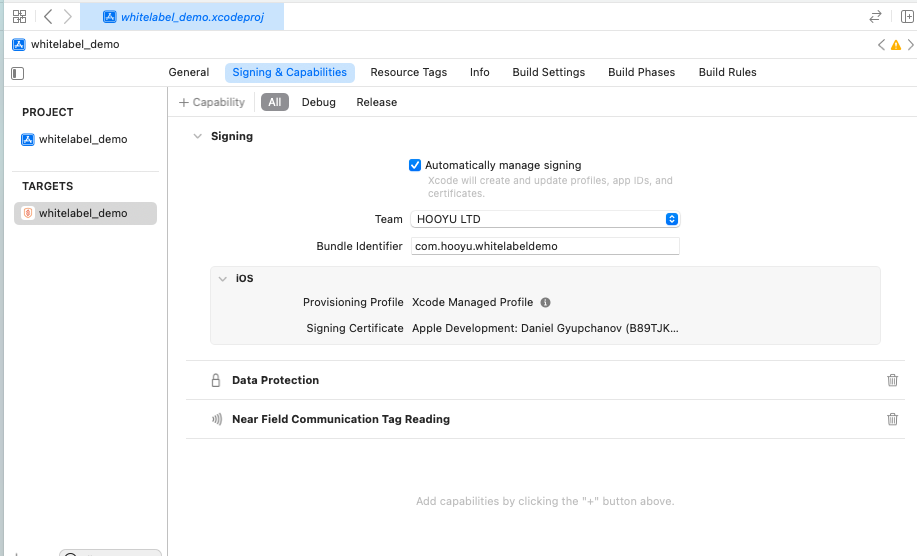

# MiVIP SDK Developer Guide

MiVIP’s Native SDK, available for iOS and Android, is a fully orchestrated user interface and user journey delivered as an SDK for seamless integration into any native application. The functionality is replicated from the existing Web journey where the same orchestration and white-label customisations are applied, as configured in one centralised location via the web portal. The SDK is packaged together with Mitek’s capture technology, MiSnap. Mitek’s customers can benefit from both Mitek’s market leading capture experience combined with a completely pre-built dynamic user journey, all delivered in a single packaged SDK with low code integration for minimum integration effort and accelerated time to live.

Supported identity sources:

* Face capture - guided capture (using MiSnap), active liveness or selfie capture
* Documents - POI/POA - guided capture (using MiSnap), upload document image or image + PDF for POA
* Document NFC reading - using MiSnap intelligent NFC orchestration
* Payment card
* Video - Assisted / Unassisted
* Signature
* Attachments
* Open banking
* Voice

SDK also includes wallet/account/history functionality.

## Installation

1. [Cocoapods](https://guides.cocoapods.org/using/using-cocoapods.html)
* add MiVIP pod dependancy. It will download all needed dependancies including MiSnap

pod 'MiVIP', '3.6.0'

* Obtain MiSnap [license key](https://github.com/Mitek-Systems/MiSnap-iOS?tab=readme-ov-file#license-key)

2.  [Swift Package Manager (SPM)](https://developer.apple.com/documentation/swift_packages/adding_package_dependencies_to_your_app)
* Add [MiSnap SDKs](https://github.com/Mitek-Systems/MiSnap-iOS) and obtain a license key
* Add MiVIP package dependancies ([https://github.com/Mitek-Systems/MiVIP-iOS](https://github.com/Mitek-Systems/MiVIP-iOS))
* Add external dependancy [SocketRocket](https://github.com/facebookincubator/SocketRocket) version 0.6.1

3.  Manual installation - you need to install MiSnap SDKs first  - [https://github.com/Mitek-Systems/MiSnap-iOS](https://github.com/Mitek-Systems/MiSnap-iOS)

* On top of MiSnap - drag additional MiVIP SDKs to Frameworks folder:

<center>



</center>

* There are few 3-rd party dependencies required. Here is an example Podfile:

```
source 'https://github.com/CocoaPods/Specs.git'
        platform :ios, '13.0'
        
        target 'whitelabel_demo' do
          # Comment the next line if you don't want to use dynamic frameworks
          use_frameworks!
        
          # Pods for whitelabel_demo
          pod 'SocketRocket', '0.6.1'
          pod 'MiSnap', '5.6.0'
          pod 'MiSnapUX', '5.6.0'
          pod 'MiSnapFacialCapture', '5.6.0'
          pod 'MiSnapFacialCaptureUX', '5.6.0'
          pod 'MiSnapVoiceCapture', '5.6.0'
          pod 'MiSnapVoiceCaptureUX', '5.6.0'
          pod 'MiSnapNFC', '5.6.0'
          pod 'MiSnapNFCUX', '5.6.0'
        
        end

```

* SDKs must be embedded and signed in the main app:

<center>


</center>

## Configuration / customisation

* MiVIP backend URL - define MiVIP instance URL in _Info.plist,_ key _HOOYU_API_URL:_
``` xml
    	<key>HOOYU_API_URL</key>
    	<string>_MIVIP_INSTANCE_URL_</string>
```

* Company logo

    - Add image in _Assets.xcassets_
    - Add property _logo_image_ in _Info.plist_

* Main colours - predefine colours in _Info.plist_ (note business console customisation is with higher priority)
``` xml
    	<key>alert_color</key>
    	<string>#FF203F</string>
    	<key>button_gradirn_end_color</key>
    	<string>#82368c</string>
    	<key>button_gradirn_start_color</key>
    	<string>#e31836</string>
    	<key>button_text_color</key>
    	<string>#FFFFFF</string>
    	<key>header_color</key>
    	<string>#002548</string>
    	<key>main_color</key>
    	<string>#e31836</string>
    	<key>menu_item_background</key>
    	<string>#ffffff</string>
```

* Texts / Localisations - all texts + keys used by the SDK are exposed in example app’s Localizable.strings file. Changing value for given key will change the text in the UI. Main app can add different translations using defined keys.

* Custom fonts
    - Import your font into the project
	- Add new key "Fonts provided by application" on application's info.plist file and add your font names
    - Set MiVIP SDK font names. If given font size not set MiVIP will use system font
	``` swift
		mivip.setFontNameUltraLight(fontName: "WorkSans-ExtraLight")
		mivip.setFontNameLight(fontName: "WorkSans-Light")
		mivip.setFontNameThin(fontName: "WorkSans-Thin")
		mivip.setFontNameBlack(fontName: "WorkSans-Black")
		mivip.setFontNameMedium(fontName: "WorkSans-Medium")
		mivip.setFontNameRegular(fontName: "WorkSans-Regular")
		mivip.setFontNameSemiBold(fontName: "WorkSans-SemiBold")
		mivip.setFontNameBold(fontName: "WorkSans-Bold")
		mivip.setFontNamHeavy(fontName: "WorkSans-ExtraBold")
	```

## Permissions for the main app
Application will ask user to grant permissions when needed (e.g. when start capture or voice session). Main app should define that may require such permissions:

* Camera
* Microphone

## NFC config

* Add app capability - _Near Field Communication Tag Reading_

<center>



</center>

* Add _CoreNFC.framework_ in _Frameworks, Libraries and Embedded Content_ for your target
<center>


</center>

* Add following key/values to _Info.plist_ file
``` xml
    	<key>com.apple.developer.nfc.readersession.felica.systemcodes</key>
    	<array>
    		<string>12FC</string>
    	</array>
    	<key>com.apple.developer.nfc.readersession.iso7816.select-identifiers</key>
    	<array>
    		<string>A0000002471001</string>
    		<string>A00000045645444C2D3031</string>
    		<string>A0000002472001</string>
    		<string>A000000003101001</string>
    		<string>A000000003101002</string>
    		<string>A0000000041010</string>
    		<string>A0000000042010</string>
    		<string>A0000000044010</string>
    		<string>44464D46412E44466172653234313031</string>
    		<string>D2760000850100</string>
    		<string>D2760000850101</string>
    		<string>00000000000000</string>
    	</array>
```

* Ensure you have NFC TAG reading in _APP_NAME.entitlements_ file
``` xml
        <?xml version="1.0" encoding="UTF-8"?>
        <!DOCTYPE plist PUBLIC "-//Apple//DTD PLIST 1.0//EN" "http://www.apple.com/DTDs/PropertyList-1.0.dtd">
        <plist version="1.0">
        <dict>
        	<key>com.apple.developer.nfc.readersession.formats</key>
        	<array>
        		<string>TAG</string>
        	</array>
        </dict>
        </plist>
```

## SDK usage
``` swift
        import MiVIPSdk
        import MiVIPApi
    	…
    
            let mivip = MiVIPHub()
            mivip.setSoundsDisabled(true) // enable/disable short sound/vibration notification when something happens (e.g. document processing complete)
            mivip.setReusableEnabled(false) // disable/enable wallet option
    	…
    
    	// Start SDK with request QR code scan option
    	mivip.qrCode(vc: self, requestStatusDelegate: self, documentCallbackUrl: documentCallbackUrl)
    
    	// Directly open ID request
    	let idRequest = "35cd1bf3-553b-485e-822f-bba55c9b03e3"
    	mivip.request(vc: self, miVipRequestId: idRequest, requestStatusDelegate: self, documentCallbackUrl: documentCallbackUrl)
    
    	// See history of opened requests:
    	mivip.history(vc: self)
    
    	// Show stored user identity (if wallet is enabled)
    	mivip.account(vc: self)
```
* _requestStatusDelegate_ - optional parameter when opening request. If set SDK will send callbacks to main application at request status change.

	``` swift
	extension ViewController: MiVIPSdk.RequestStatusDelegate {
		
		func status(status: MiVIPApi.RequestStatus?, result: MiVIPApi.RequestResult?, scoreResponse: MiVIPApi.ScoreResponse?) {
			// "RequestStatus = Optional(MiVIPApi.RequestStatus.COMPLETED), RequestResult Optional(MiVIPApi.RequestResult.PASS)"
			debugPrint( "RequestStatus = \(status), RequestResult \(result), ScoreResponse \(scoreResponse)")
		}
		
	}
	```

* _documentCallbackUrl_ - optional parameter when opening request. If set (and callback domain whitelisted at MiVIP) document API will notify with server to server callbacks for document status. Must start with https://

* Initialisation of MiVIPHub may throw error if no valid MiSnap license set
	``` swift
	do {
		let mivip = try MiVIPHub()
		...
		
	} catch let error as MiVIPHub.LicenseError {
		print(error.rawValue)
	}
	```

# SDKs Files and Sizes

SDK is packed as xcframework (universal framework) that provide device + simulator framework

* MiVIPApi.xcframework - includes API calls and handle results.
* MiVIPLiveness.xcframework - implementation of active liveness.
* MiVIPSDK.xcframework - includes journey orchestration and UI.

<center>

| Component                        | Compressed     | Uncompressed     |
| :------------------------------- | :------------: | :--------------: |
| MiVIPApi                         |  550KB         |  1.6MB           |
| MiVIPLiveness                    |  74KB          |  200KB           |
| MiVIPSDK                         |  13MB          |  15MB            |
| All + external dependancies      |  13.7MB        |  17.2MB          |

</center>

Sizes are taken from "App Thinning Size Report.txt" of an Xcode distribution package for the latest iOS version where `compressed` is your app download size increase, and `uncompressed` size is equivalent to the size increase of your app once installed on the device. 

In most cases you should be interested in `compressed` size since this is the size increase to your installable on AppStore that has network limitations depending on the size.

Refer to "Create the App Size Report" section of [this article](https://developer.apple.com/documentation/xcode/reducing-your-app-s-size#Create-the-App-Size-Report) for more details.


## System Requirements

<center>

| Technology | Version |
| :--- | :---: |
| MiSnap | 5.6.0 |
| Xcode | 14.0 |
| iOS | 13.0 |
| iPhone | 7 |

</center>